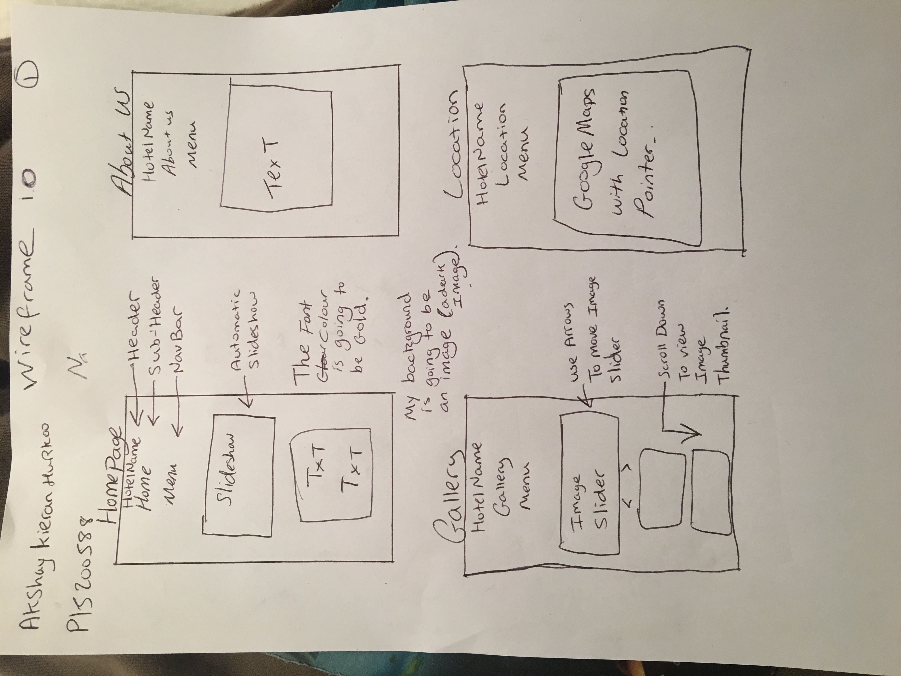

# CTEC3905 Front-End Web Development / Hotel Promotion Website
### Created by Akshay Kieran Hurkoo P15200588 - De Montfort University, Leicester
##what is my website about?
I created my website to be a hotel promotion website. its for a hotel that is going to be launched soon, located in the the middle east (Dubai). The website features slideshows, a map of where the hotel is located, a youtube promotion video, a gallery which an image slider and thumbnails. 

## validation And Testing
I have used the recommened website to validate my website and i can ensure that it has been successfully validated. 
two users tested my website. They first viewed it on their mobile then after viewed it on a desktop computer. They got back to me and said that it works perfectly fine on their mobile device. 

## software
The software i used to create my website is known as brackets. <ahref="http://brackets.io/">Brackets</a>, I really enjoyed using this software, as it was clear to use. It allowed me to have a veritcal split which gave me the opportunity to work on two different html pages/ spreadsheet at the same time. Another feature that i found was really impressive was the live preview feature. This gave me a live update whenever I made a change on the page/ spreadsheet.

## Issues
There were numerous errors that occured. One of the first errors was media queries not working as they should be. Soon after I found out that it was due to my media screen size being max width, instead of min width. The media query ended up changing the page for the mobile view instead of the desktop view. I rectifed the problem by changing max width to min width. Another problem i encountered and still haven't rectified is the google maps api at times wouldnt load first hand, and instead i would have to refresh the page in order for it to load.

## navigation plan
below is my navigation plan that i have sketched

## wireframes
below is are my wireframes that i sketched. 

